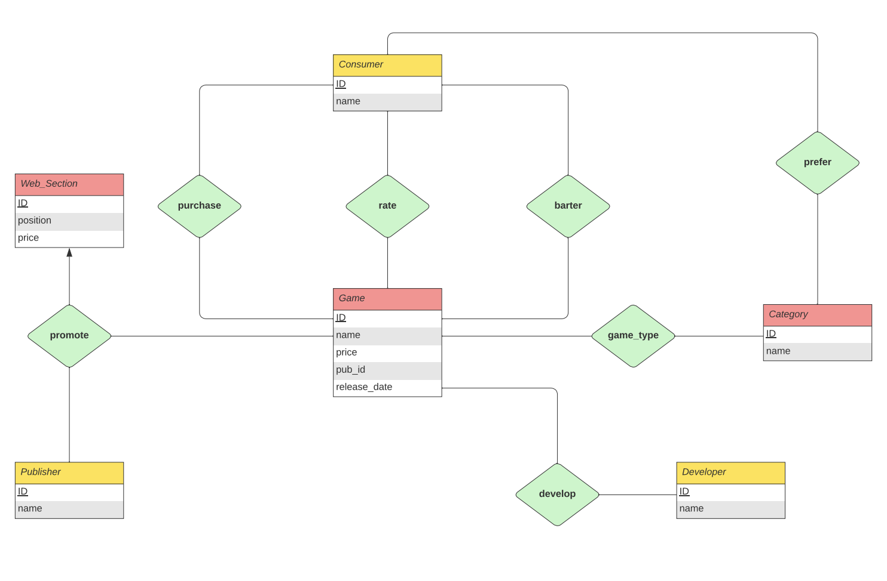
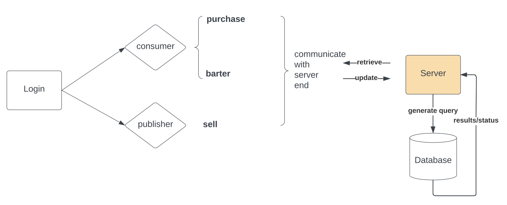
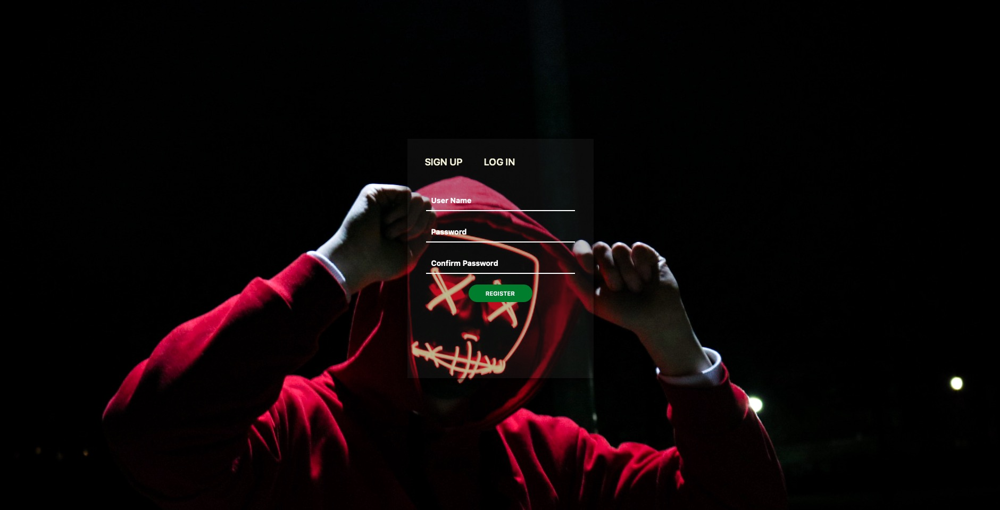
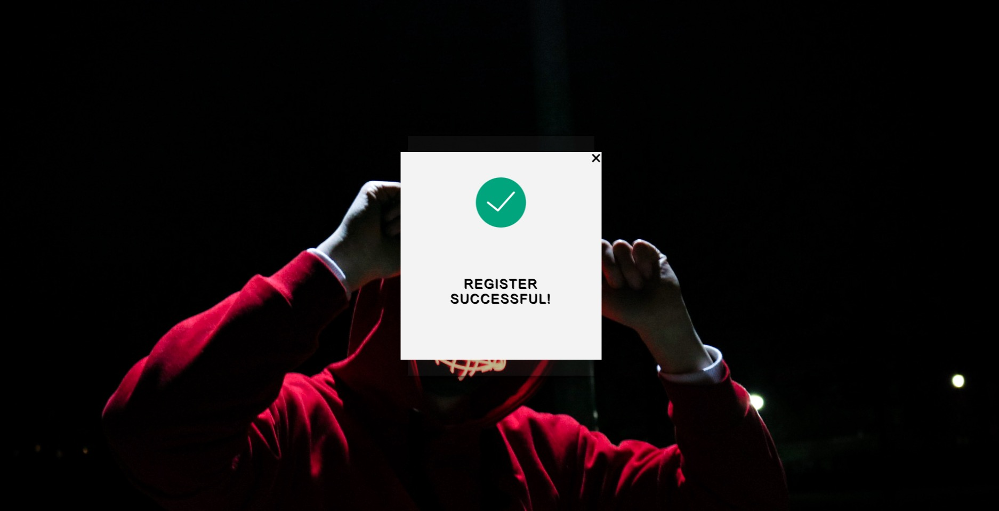
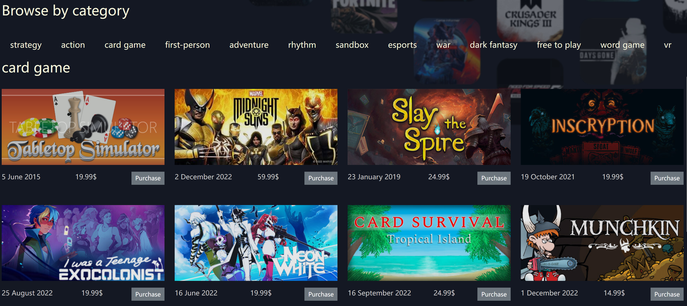

[](https://classroom.github.com/online_ide?assignment_repo_id=9422637&assignment_repo_type=AssignmentRepo)
# CSC3170 Course Project

## Project Overall Description

This is our implementation for the course project of CSC3170, 2022 Fall, CUHK(SZ). For details of the project, you can refer to [project-description.md](project-description.md). In this project, we will utilize what we learned in the lectures and tutorials in the course, and implement either one of the following major job:

<!-- Please fill in "x" to replace the blank space between "[]" to tick the todo item; it's ticked on the first one by default. -->

- [x] **Application with Database System(s)**
- [ ] **Implementation of a Database System**

## Team Members

Our team consists of the following members, listed in the table below (the team leader is shown in the first row, and is marked with 🚩 behind his/her name):

<!-- change the info below to be the real case -->

| Student ID | Student Name | GitHub Account (in Email) | GitHub Username |
| ---------- | ------------ | ------------------------- |-----------------|
| 120090326  | 房子皓 🚩    | fzh0424@outlook.com       | [Adorable-Qin](https://github.com/Adorable-Qin)   |
| 120090234  | 王森         | 120090234@link.cuhk.edu.cn| [TheKingOfForest](https://github.com/TheKingOfForest) |
| 120090320  | 尹无非       | 120090320@link.cuhk.edu.cn| [Wuswufei](https://github.com/Wuswufei)  |
| 120090225  | 郑家豪       | 120090225@link.cuhk.edu.cn | [Ayaaaka-zheng](https://github.com/Ayaaaka-zheng) |
| 120090188  | 李子涵       | noah_822@163.com          | [noah822](https://github.com/noah822) |
| 119010423  | 章辰舸       | 1418457284@qq.com         | [cheanz](https://github.com/cheanz) |
## Project Specification

After thorough discussion, our team made the choice and the specification information is listed below:

- Our option choice is: **Option 2**
- Our branch choice is: **Branch 1**
- The difficulty level is: **Normal**

As for Option 2, our topic background specification can be found in [background-specification.md](background-specification.md).

## Project Abstract

### Overview

In this project, we hope to implement an advanced game distribution platform, where both the consumer, or say the player, and the saler, or say the game publisher can get involved.

As a player, you can either purchase a game like you normally do on any game platform or barter for a game. Bartering is a new concept we try to introduce to our platform. One possible scenario where you may want to barter for a game is you would like to exchange a game, which you no longer want to play, for another game you interested in with somebody else.  Players can put the game to exchange and their wishlist on the platform, and then wait for others to make the deal.

As a publisher, you can upload the game to sell and make purchases with the platform to determine where the sale info will be displayed on the webpage.

In this project, we hope to incorporate as many aspects of database as possible, ranging from normal operations: select, insert, delete to more advanced topics: privilege granting, concurrency, etc.

### ER Diagram



[Schema Details](/docs/database/schema.md)

### Application Workflow




## Report

presentation video link: 

presentation slides link:

To configure the environment ,run the app and resolve possible issues may occur , see [guide](/guide) for details.


### Program Design

```
.
├── docs		     ... supporting details for README.md
├── guide		     ... guideline for environment setup and running the app
├── pics		     ... pictures for README.md
├── scrap 		     ... web scrap implementation
│   ├── dict 		     ... ID corresponds to category/publisher/developer name, generated mannually
│   │   └── *.pickle 
│   ├── game_scrap.py	     ... main function for scrapping
│   ├── schema.py/utils.py   ... utils used in game_scrap.py
│   ├── random_gen.py	     ... post-processing scrapped raw data
│   └── game.pickle	     ... games stored for database initailization
│
├── server
│   ├── database 
│   │   ├── init            ... initialize database
│   │   │   └── db_insert.py/schema.py		
│   │   └── API.py	    ... mysql query function used by the server 
│   ├── static 		    ... flask reserved folder, storing static data, such as pictures, js, css files
│   ├── templates	    ... flask reserved folder, storing html templates to be rendered
│   └── app.py		    ... app implementation
│
├── dump.sql		    ... dumped database at initial state for reference
└── requirements.txt	    ... environment requirements for conda     
```


### Database

$\bullet$ Static Data Acquisition (**/scrap**)

Static real-life data of the database to start with is obtained by scraping the top seller games webpage provided by [SteamDB](https://steamdb.info/stats/globaltopsellers/). Key components scrapped are listed below,

<font face="courier" style="text-align: center">ID, name, developer, publisher, price($), image</font>

Note that we modify the raw data a little bit for the sake of simplicity, for example we restrict the number of publisher of a game can only be one.

Scrapped games are stored in form of *.pickle file(/scrap/game.pickle) as <b><font face="courier">class Game</font></b>, the prototype of which can be found in **/scrap/schema.py**. Scrapped images are stored in **/server/static** folder. 


$\bullet$ Schema ([Details](/docs/database/schema.md))

1. Not all the tables designed initially are used in this project, such as **web_section**, **prefer**. In future work, they might be utilized to extend the functionality of our platform.
2. The usage of the majority of the tables is obvious. Here we only point out the **meta** table, which is used to track the current state of the platform to determine the ID to be assigned to when new user/publisher/developer comes in.


$\bullet$ Database APIs

<b><font face="courier">mysql-connetor-python</font></b> is the sql package we choose for this project.

a. Database Init(**/server/init/db_insert.py**)

The database is initialized by executing **db_insert.py**, which completes table creation, row insertion, user creation and user privilege granting. Row insertions are completed by reading the python objects stored in *.pickle files, including **/scrap/game.pickle** and **/scrap/dict/\*.pickle**


b. Multithreaded Database Handler Feature(**/server/database/API.py**, [Details](/docs/database/multithread.md))

Every time the server is booted, three threads are dispatched as the database handler, namely 'super', 'consumer', 'saler'. Each of them is granted with different privileges for safty issue(details can be found in the last several lines in **/server/database/db_insert.py**).  Also, a faster response speed of the server is expected with the concurrency provided by the multithreaded feature. This mechanism is scalable.

A function wrapper <b><font face="courier">@handler()</font></b> is implemented to dispatch the job to a given thread

```
@handler('super')
def job():
	...
```

In this example, when the function <b><font face="courier">job()</font></b> is invoked, it will be queued to 'super' thread to get executed.


c. Specific API Functions(**/server/database/API.py**)

Functions used by the server is implemented in **/server/database/API.py**, which will then be imported in **/server/app.py**. As we previously suggested, each of the functions are paired with a handler thread.

### Account

To store the needed information such as games that you owned or you want to barter, customers are required to log in before entering the market, library or barter page. If you haven't been one of us, you need to register an account first.

You can sign up your account and log in to our website in the following page:


When you successfully sign up an account, you will see the following page:


### Market

Once you registered and log in our platform, you will enter the market page. It is the index page and one of the fundamental page.

The navigating bar will show your user name (near the game console logo), a **Market button**, a Library button and a **Barter button**. You can switch to the different pages by clicking navigating buttons at the top.


In Market page, our Advanced Game Distribution Platform will show you several **Featured & Recommended** games at the top side. You are able to browse these **featured games** or you can also **browse games by category**. Each item in this page will provide you with its **name**, **release date** and **price**. You can hover on the game to find its name. You have two choices of the game you are interested, add it to your library of games immediately by clicking the 'Purchase' button at the bottom right corner, or, click the image of the game to access the game detail to double check your order. Once your purchase is made, you can check the game you owned in Library page.



If you would like to have multiple accounts, it is possible for sure. We provide a 'log out' button at the top right corner in the market page to let you log out the current account so that you can use other account(s).

For a game developer or publisher, you need to access the game detail page to upload your game.
